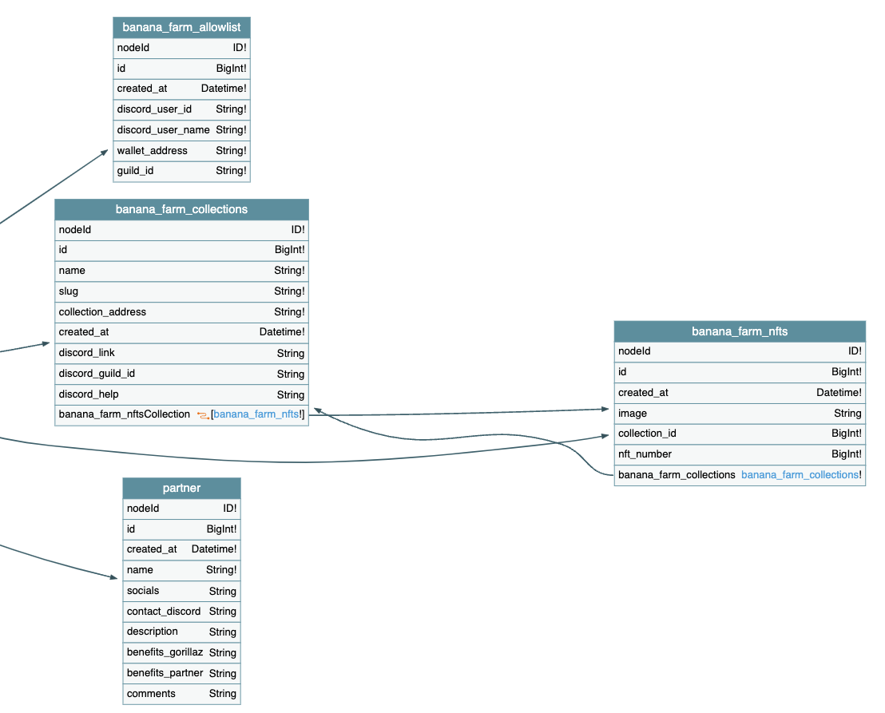

# Component Overview

## Frontend

The Website is built as a React Application.

It uses:

- Chakra UI as UI library
- Aptos Typescript SDK to interact with the Movement Blockchain
- SupabaseJS to fetch data from the database
- Tanstack React Query to fetch and cache data

## Setup script

Setup script to run after deploying the Smart Contracts:

- [deploy-bananafarm](scripts/deploy-bananafarm.ts)

The script does the following operations:

1. Minting Coins: Mints 100,000,000 units of the "banana" coin to the admin account.
2. Depositing Coins: Deposits 10,000,000 units of the "banana" coin into the banana farm treasury.
3. Creating Collections:
   - Creates a "Farmer | Gorilla Moverz" collection with a max supply of 4000 and sets its address as primary collection.
   - Creates a "Gorillaz Partner 1" collection with a max supply of 2000.

## Database

The supabase database contains the following tables:

- banana_farm_allowlist: Every allowlist request from the discord bot is tracked here to block duplicate submissions for a user
- banana_farm_collections: Tracks all active nft collection for farmer and partners
- banana_farm_nfts: All available nfts. Used to build the metadata (for later extension).
- partner: All partner requests from the partner form are tracked here

## Supabase edge functions

- [discord-nft-allowlist](supabase/functions/discord-nft-allowlist/) Hosts the discord bot to put addresses to the allowlist (async, calls nft-allowlist to do the actual job), because the bot need to respond within 3 seconds. Only pre-checks are done here.
- [nft-allowlist](supabase/functions//nft-allowlist/) Puts addresses to the allowlist (uses the Aptos TS Client to interact with the allowlist)
- [discord-webhook](supabase/functions/discord-webhook/) Webhook that is called when inserting data into the partner table. Posts a message to a discord channel to infom about new partner requests
- [nft-banana-farmer](supabase/functions/nft-banana-farmer/) Serves the NFT metadata. Served here to easy extend. Can be replaced with IPFS or similar for mainnet.
