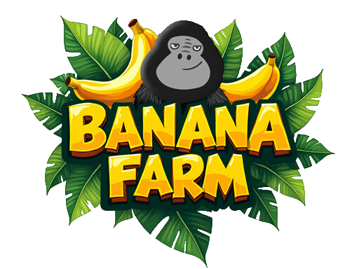
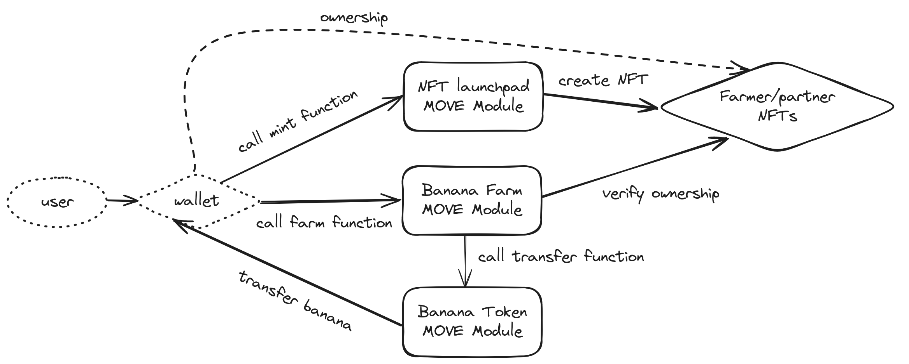
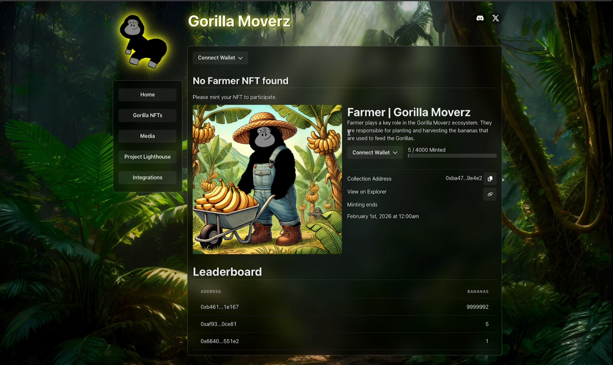
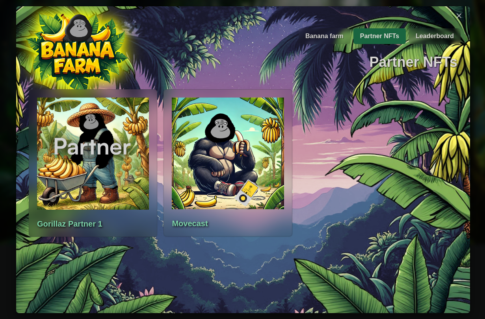
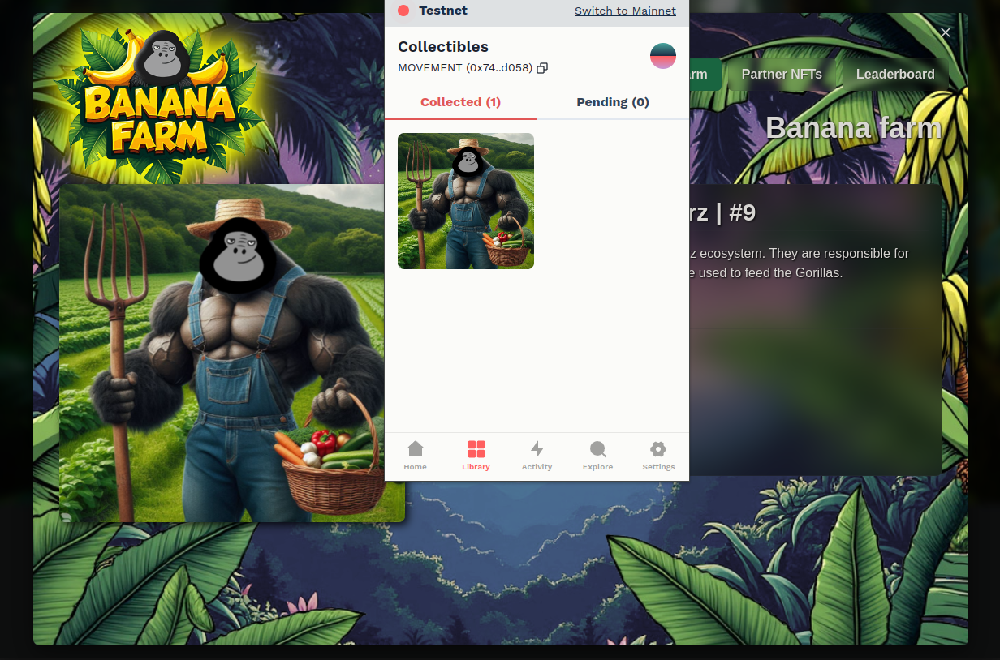
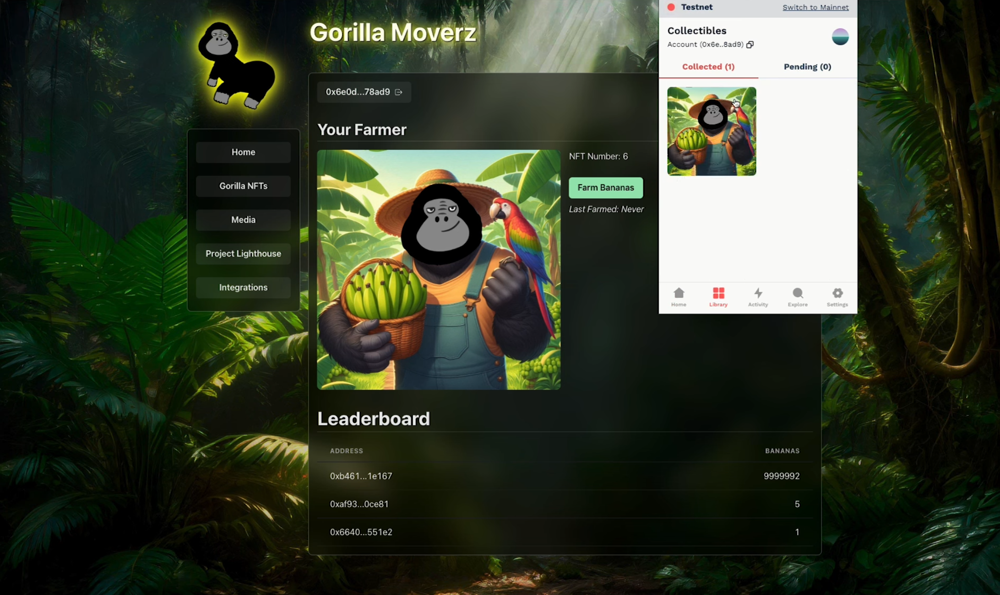

# 🍌 Gorilla Moverz: Banana Farm

<h4 align="center">
  <a href="https://gorilla-moverz.xyz">Website</a> | 
  <a href="https://www.youtube.com/watch?v=PjMEkM_0yog">Demo video</a>

</h4>
 
🍌 Banana Farm, is an innovative and interactive NFT-based farming game where users mint NFTs, known as Farmers, to cultivate virtual bananas. The game operates on a time-based farming mechanism where bananas can be harvested after specified intervals, with the frequency and amount dependent on the time elapsed since the last harvest.

⚙️ Built using React, Move, Supabase Database, Supabase Edge and Typescript.

- 👨‍🌾 **NFT Farming:** Users mint a Farmer NFT to start farming virtual bananas, creating an engaging and rewarding gameplay loop.
- ⏱️ **Dynamic Timeouts:** Admins can adjust farming intervals, adding a layer of strategy and unpredictability to the game.
- 🏆 **Leaderboard:** A competitive ranking system based on the number of bananas farmed, encouraging players to strive for the top.
- 🗒️ **Allowlist Minting:** Users gain access to mint Farmers by joining a Discord server, fostering community growth and exclusivity.
- 🤝 **Partner NFTs:** Special NFTs that give users farming bonuses, incentivizing collaboration and participation in partner communities.

# Diagram

# Screenshots

| Main page                    | Partner NFT overview               |
| --------------------------------- | --------------------------------- |
|  |  |

| Farmer NFT minted                       | Farming bananas                      |
| --------------------------------- | --------------------------------- |
|  |  |

# Local Development

The instructions to setup a local environment for the Banana farm can be found in [CONTRIBUTING.md](CONTRIBUTING.md). This also includes the steps needed to add a Partner NFT.

# Next steps

We completed everything we set out to do for the scope of this hackathon. Any additional features and fixes will be listed under [Issues](https://github.com/gorilla-moverz-dao/gorilla-moverz-website/issues).

# Links 
- [Website](https://gorilla-moverz.xyz)
- [Deployed Move Module](https://explorer.aptoslabs.com/account/0x054211d69a169a86cb370b0492a20382160c5cb62f3a0524c15f2678c20a7c1e/modules/code/banana?network=testnet)
- [Gitbook documentation](https://arjanjohan.gitbook.io/banana-farm)
- [Github](https://github.com/gorilla-moverz-dao/gorilla-moverz-website/)
- [Demo video](https://www.youtube.com/watch?v=PjMEkM_0yog)

# Team

- [Urs Lee](https://x.com/ursleee)
- [arjanjohan](https://x.com/arjanjohan)